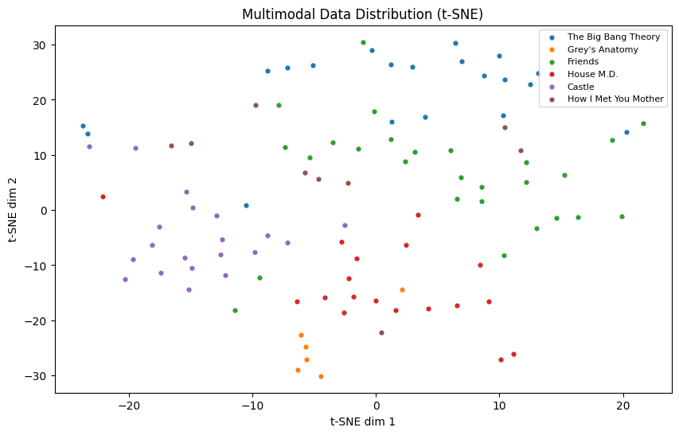

# Homework 1 - Multimodal TVQA Preprocessing

For our first homework assignment, I performed the process of pre-processing data from the TVQA dataset to use for training multimodal models. This dataset contains short video clips and questions about their content.

The modalities extracted include:
- Visual information (video frames/visual concepts)
- Textual information (subtitles and questions)
- Temporal information (timestamps)

The goal is to analyze the video clips and answer questions about their content using multimodal reasoning.

### Data Visualizations

Below are two visualizations of the pre-processed multimodal data:

**1. Multimodal Data Distribution (t-SNE)**

This t-SNE plot projects the multimodal embeddings (subtitle TF-IDF and visual concept TF-IDF) into a 2D space. The data forms distinct clusters by TV show indicating that the features successfully capture show-specific semantic and visual patterns.

**2. Non-zero Input Feature Distribution**

This histogram visualizes the distribution of the non-zero input features. It confirms the high sparsity of the TF-IDF features used for the multimodal representations.
