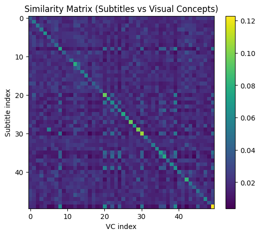
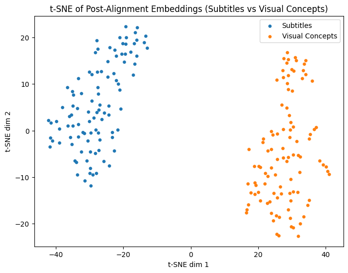
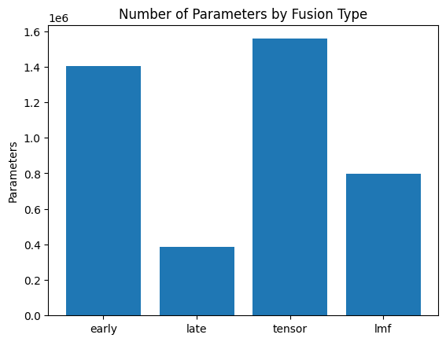
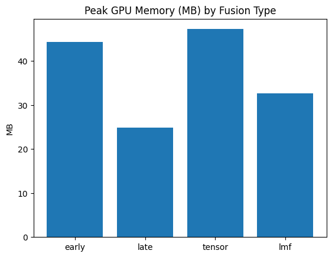
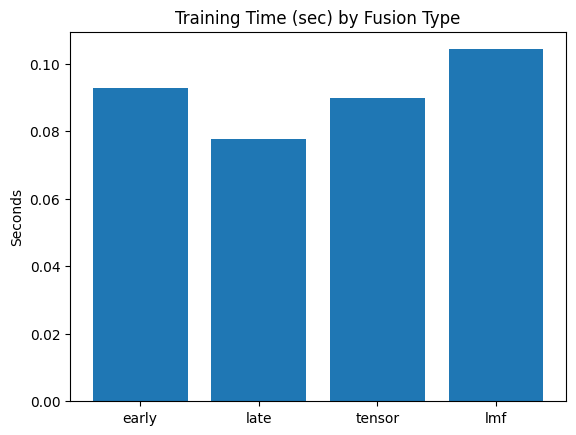

# Homework 2 - Multimodal Fusion and Alignment

In this assignment, we explored different multimodal fusion techniques (Early, Late, Tensor, and Low-Rank Tensor Fusion) and evaluated their performance on the AV-MNIST dataset as well as our custom TVQA dataset built in Homework 1. We also implemented contrastive learning to align visual concept features with semantic subtitle features.

### Key Results
- **Late Fusion** proved robust with the best validation accuracy (0.3) & test accuracy (0.6) on the TVQA dataset, proving to be the most resilient against the noisy feature alignment step.
- Implemented **Contrastive Learning** on visual concepts vs. subtitles using a symmetric cross-entropy loss over a similarity matrix, demonstrating the capability to bring paired samples closer together.

Future directions involve employing explicit cross-attention in the video QA task to compositionally reason over the aligned modalities.

### Visualizations

**1. Contrastive Learning: Similarity Matrix Heatmap**  
  
This heatmap shows the probabilities between subtitles and visual concepts post-alignment. The strong diagonal confirms that our Contrastive Learning successfully pulled the paired items closer together in the shared embedded space, acting as proof that correct multimodal alignments were learned even from noisy timestamp features.

**2. Post-Alignment Embedding Clusters (t-SNE)**  
  
A t-SNE scatter plot comparing the two aligned modalities. It is fascinating to reflect that while paired items are matching closely (as shown by the heatmap), the overall macro-structures of Subtitles (natural dialogue text) and Visual Concepts (discrete object lists) still maintain distinct, separate geometric topologies in their projected dimension.

**3. Fusion Techniques: Cost vs. Performance Trade-offs**  

These bar charts quantify the hardware and training trade-offs in Parameters, Peak GPU Memory (MB), and Training Time (sec) across the 4 fusion approaches. Our findings indicated that the computationally simplest **Late Fusion** provided the best stability and accuracy for this specific dataset, significantly out-performing more complex but brittle methodologies like early and tensor fusion that exploded the feature space.