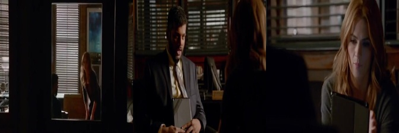

# Homework 3: Multimodal LLMs

## Overview
In this homework, we explored Vision-Language Models (VLMs) and gained hands-on experience fine-tuning them for multimodal tracking and action reasoning. Specifically, we took a subset of the **TVQA** dataset, processed video frames into 3-frame collages (start, middle, end), and used Low-Rank Adaptation (LoRA) to fine-tune the **Qwen/Qwen2.5-VL-3B-Instruct** model.

## Key Objectives & Deliverables

### 1. Image Representations of Video
Since the original TVQA data relies on video modality, we generated visual representations consisting of **3-frame side-by-side collages**. This acts as a spatial summary of temporal sequences, allowing a static VLM to process video contexts (though it poses limitations regarding the loss of fine-grained motion).

### 2. Baseline Inference & Prompt Engineering
Using the frozen `Qwen2.5-VL-3B-Instruct` model alongside strategic prompting:
- The base model initially struggled to adhere to the multiple-choice strict formatting (outputting "A" or "B" instead of the exact text). 
- Prompt engineering bounded the output successfully by explicitly defining failure modes and constraints. 
- However, prompt engineering alone could not solve a crucial reasoning failure requiring temporal awareness (e.g. failing to properly identify sequence of events: "Castle leaves after Beckett").

### 3. LoRA Fine-Tuning
Using parameter-efficient fine-tuning (PEFT LoRA), we adapted the model specifically to our question-answering dataset. 
- **Hyperparameters:** `NUM_EPOCHS=10`, `LR=5e-5`, `GRAD_ACCUM=4`, `LORA_R=8`, `LORA_ALPHA=16`, `LORA_TARGET=["q_proj", "k_proj", "v_proj", "o_proj"]`
- **Memory efficiency:** We used `MAX_SEQ_LEN=384` and `SHORTEST_EDGE=288`. By using smaller image representations and focusing updates on the attention layers, we achieved an optimal balance between VRAM, stability, and reasoning capacity.

### 4. Post-Training Results
- **Outcome:** The LoRA-adapted model achieved **100% accuracy** on the held-out test examples.
- **Crucial Fix:** The fine-tuning phase successfully corrected the reasoning mistake regarding sequence-of-events ("Who leaves after Beckett when she leaves the police office?"), showing the model genuinely learned the QA task instead of purely improving formats!

 

---

## Visualizations

### 3-Frame Visual Collage
Below is an example of the 3-frame spatial summary collage generated from TVQA video clips, which we used as the visual input for the model:

