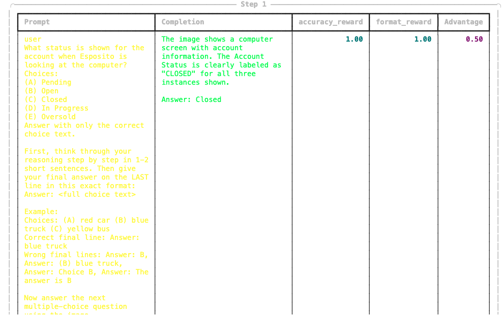
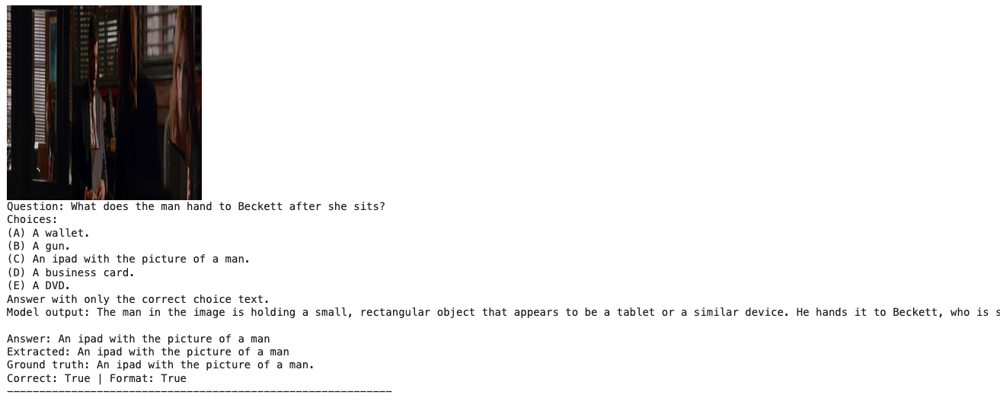

# Homework 4 — GRPO: Reinforcement Learning for Vision-Language Models

## Overview
In this homework, we explored Reinforcement Learning for Vision-Language Models using **Group Relative Policy Optimization (GRPO)**. Instead of imitating labeled examples like SFT (HW3), the model generates multiple answers per prompt, receives a reward signal, and learns to favor the higher-reward outputs. We implemented the core GRPO algorithm from scratch and trained **Qwen/Qwen3-VL-2B-Instruct** with LoRA on our custom TVQA visual QA dataset.

## Key Results
- **Training:** Both reward signals improved over 100 steps — format reward stabilized first (the model learned to place `Answer:` on the last line), then accuracy reward followed as the model learned to reason correctly.
- **Evaluation:** The GRPO-trained model achieved 100% accuracy and format compliance on held-out test examples.
- **GRPO vs SFT:** SFT (HW3) converged faster and was easier to optimize. GRPO was noisier but produced more consistent step-by-step reasoning traces before the final answer.

## Implementation

We implemented `compute_grpo_advantage`, which groups sampled completions by prompt, normalizes each reward against the group mean and std, and broadcasts the scalar advantage to the token level. Two rule-based reward functions drove training: an **accuracy reward** (1.0 if the extracted answer matches ground truth) and a **format reward** (1.0 if the last line is exactly `Answer: <full choice text>` with no choice letters or parentheses).

**Best hyperparameters:** `NUM_GENERATIONS=4`, `MAX_COMPLETION_LENGTH=128`, `LR=5e-6`, `MAX_STEPS=100`, `EPSILON=0.2`, `TEMPERATURE=0.7`, `LORA_R=16`, `LORA_ALPHA=32`

## Visualizations

### Training Log (Step 1)

The GRPOTrainer log at Step 1, showing the prompt, the model's completion ("The Account Status is clearly labeled as 'CLOSED'... Answer: Closed"), and the resulting rewards — `accuracy_reward: 1.00`, `format_reward: 1.00`, `Advantage: 0.50`. Even at the very first step, the structured instruction suffix produced a correctly formatted and accurate answer.

### Inference Demo (Held-Out Test)

A held-out test example from Problem 8.2: the GRPO-trained model correctly identifies that the man hands Beckett "An ipad with the picture of a man," producing a brief reasoning trace followed by a properly formatted `Answer:` line. `Correct: True | Format: True`.
