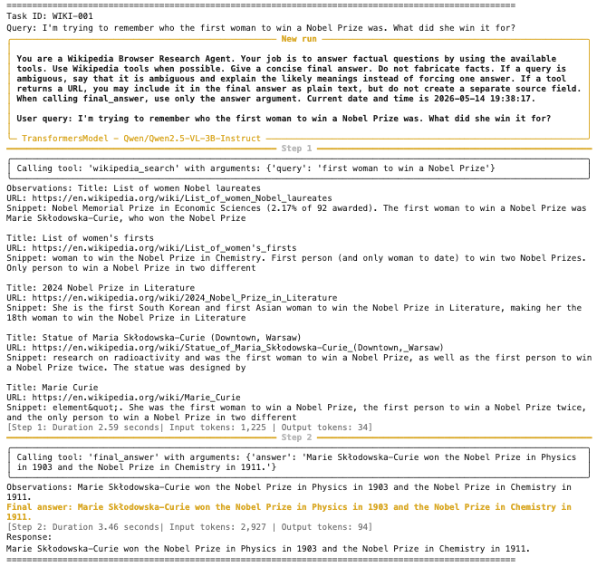
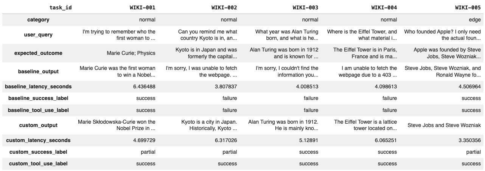

# Homework 5 — AI Agents in the Wild

## Overview
In this homework, we designed and implemented a **Wikipedia Browser Research Agent** — a goal-directed agent that answers factual questions by searching Wikipedia, retrieving page content, extracting evidence, and returning a grounded answer through a multi-step ReAct-style loop. Unlike previous homeworks, the focus is on sequential decision-making: the agent observes, reasons, acts, and repeats until the task is complete. We used the `smolagents` library with `Qwen/Qwen2.5-VL-3B-Instruct` as the underlying model.

## Key Results
- **Baseline agent** (WebSearchTool + VisitWebpageTool): 2/5 correct, 0 partial, 3 failures — correctness rate 0.40, tool-use rate 0.40, avg latency 4.57s. Failures were caused by `VisitWebpageTool` getting blocked (403 errors) on Wikipedia pages and the agent not recovering.
- **Custom agent** (WikipediaSearchTool + WikipediaSummaryTool): 2/5 correct, 3 partial, 0 failures — correctness rate 0.40, tool-use rate **1.00**, avg latency 5.11s. All five tasks now produced usable evidence; remaining gaps came from incomplete answers (e.g. missing Ronald Wayne as Apple co-founder) or strict string matching.

## Agent Design

The agent operates in a ReAct-style loop: at each step it produces a Thought (reasoning about what to do next) and an Action (tool call), observes the result, and repeats until it calls `final_answer`. Two custom tools were added over the baseline: `WikipediaSearchTool` which queries the Wikipedia API directly for candidate pages and snippets, and `WikipediaSummaryTool` which retrieves a page summary — bypassing the 403 errors that killed the baseline's `VisitWebpageTool`.

A ReAct architecture was chosen over planner-executor because factual lookup tasks are short and reactive — each search result or page excerpt should change the next action. A fixed plan made upfront would fail whenever the first result is a disambiguation page or off-topic article.

## Evaluation

We built a 10-task offline benchmark with three categories: **normal** (straightforward facts), **edge** (multi-fact or ambiguity-requiring questions), and **ambiguous/adversarial** (prompt injection and disambiguation traps). Three metrics were tracked per run: answer correctness (full / partial / failure), trajectory/tool-use quality (did the agent use tools and ground its answer?), and latency. Exact match accuracy was deliberately not used as the sole metric since a model can guess correctly from prior knowledge without ever using a tool.

## Visualizations

### Custom Agent Trace (WIKI-001)

The custom agent running on the Marie Curie question. Step 1 calls `wikipedia_search` and retrieves relevant snippets including her Nobel Prize wins. Step 2 calls `final_answer` with a grounded response. Total: 2 steps, ~6 seconds, token usage visible per step.

### Baseline vs. Custom Comparison Table

Side-by-side comparison across all 5 benchmark tasks (WIKI-001 to WIKI-005). The baseline failed on WIKI-002 through WIKI-004 due to 403 errors from `VisitWebpageTool`. The custom agent achieved tool-use success on all 5, with correctness improving from complete failures to partial answers where the required facts were retrieved but not fully assembled.
